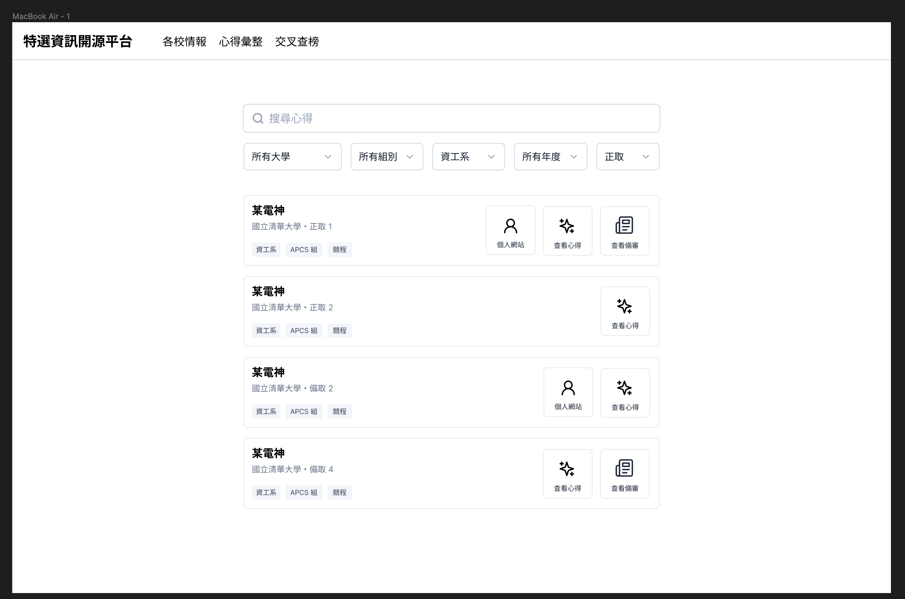

# 特選資訊開源平台 SCP-INFO

## 背景

眾所周知，特殊選才不是一個非常大眾的升學管道，也因此網路上的資訊並沒有那麼豐富，即便找得到也都非常的零散。對於想嘗試走特選的學生來說，可能面臨許多的困難，比如不確定該如何準備、不知道達到何種水準才能錄取想讀的大學，以及缺乏相關資源等。

為了解決這些問題，我想打造一個「特選資訊開源平台」，希望可以把各校特選資訊、歷年榜單還有歷屆特選生們的心得整理起來，讓更多人可以更容易、更輕鬆的查閱他們！除此之外，如果有更多時間的話還希望可以製作讓當屆的特選生們使用的交叉查榜系統。

## 設計稿

目前的設計稿只有這一頁，不過未來會繼續更新的 ouob

## 預期完成時間

沒意外的話希望可以在 9 / 10 月特選前完成並上線，畢竟我自己也很需要這個東西 XD

## Features

- 心得彙整
  - 透過視覺化的介面、更多更細的 filters 來讓使用者更容易找到自己想要的資訊
- 歷年榜單
- 交叉查榜系統（未來可能會有）
- 各校特選資訊收集
